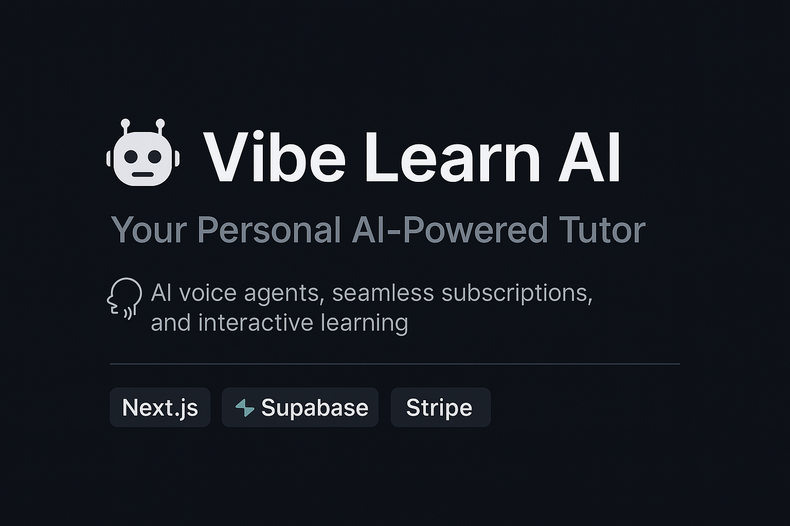

# 🎓 Vibe Learn AI — Your Personal AI-Powered Tutor

<p align="center">
<!--    -->
</p>


---

## 🌐 Live Demo

👉 [Visit the Live App](https://your-vibe-learn-app.vercel.app)

---

## ✨ Features

- 🤖 **AI Voice Tutors** — Conversational tutoring powered by real-time AI voice agents (Vapi).
- 🔐 **Authentication** — Google and multi-provider auth using Clerk.
- 💳 **Subscriptions** — Stripe billing integration with access control.
- 🧠 **Tutor Creation** — Create personalized tutors with specific subjects and teaching styles.
- 📁 **Bookmarks & History** — Easily revisit past sessions or favorite tutors.
- 🔍 **Smart Search** — Instantly find the right tutor.
- 📱 **Responsive UI** — Fully mobile-ready interface.
- ⚙️ **Reusable Codebase** — Modular architecture with clean components.
- 🌈 **Sleek UI/UX** — Built with Tailwind CSS and shadcn/ui.
- 🧪 **Type-Safe** — TypeScript + Zod validation.
- 🚨 **Sentry** — Error monitoring and performance insights.

---

## 🛠 Tech Stack

| Tech         | Role                                                             |
|--------------|------------------------------------------------------------------|
| **Next.js**  | SSR, static site generation, API handling                        |
| **Supabase** | Database, Auth, Realtime subscriptions                           |
| **Clerk**    | Authentication and session handling                              |
| **Stripe**   | Billing and subscription management                              |
| **Vapi**     | Real-time voice interactions with AI                             |
| **Tailwind** | Styling                                                          |
| **shadcn/ui**| Prebuilt, accessible components                                  |
| **Zod**      | Data validation                                                  |
| **Sentry**   | Error and performance monitoring                                 |

---

## 🧪 Quick Start Guide

### ✅ Prerequisites

- Node.js
- Git
- npm

### 📦 Installation

```bash
git clone https://github.com/adrianhajdin/saas-app.git
cd saas-app
npm install
